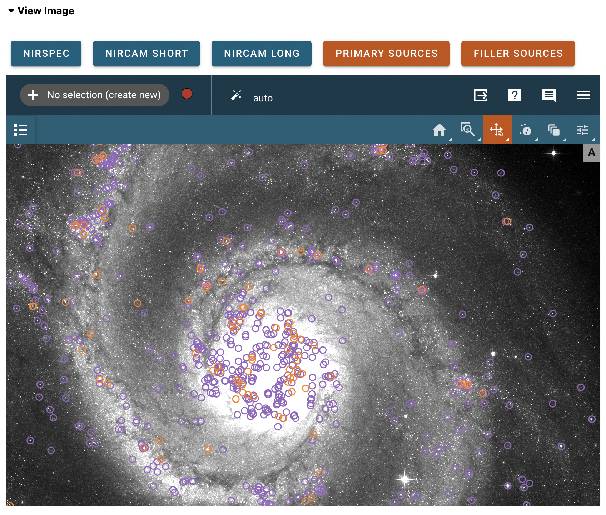
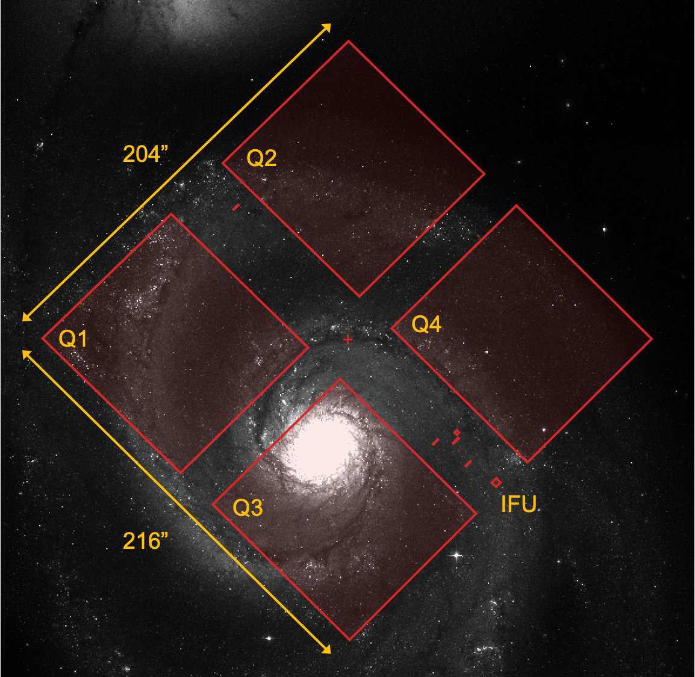
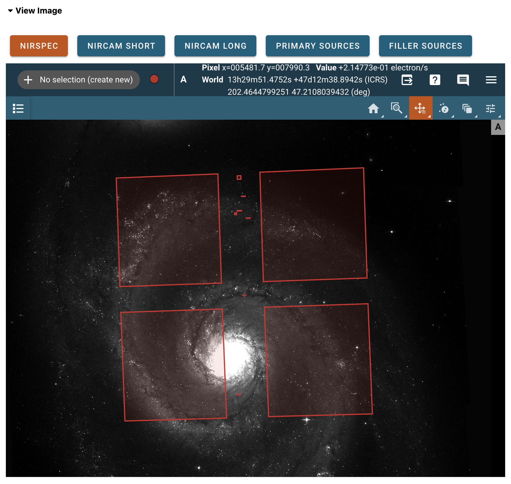
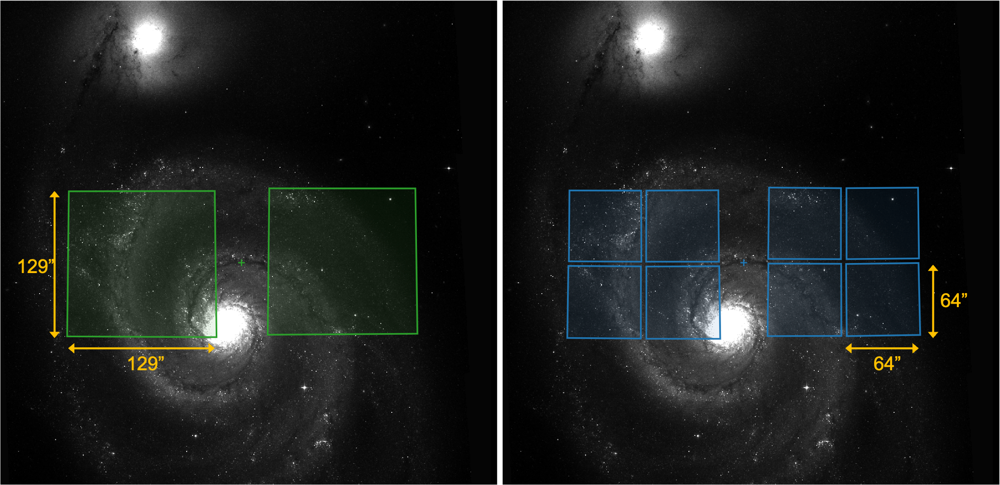
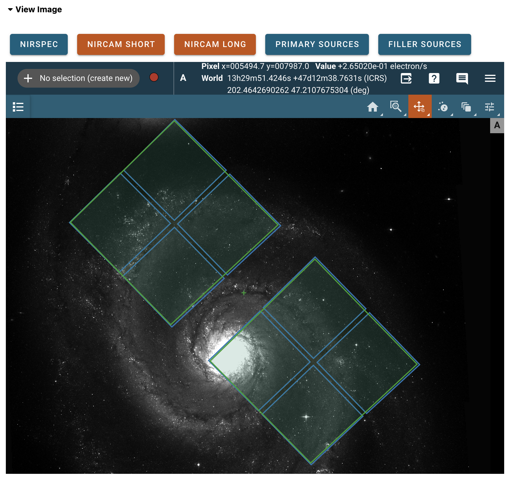
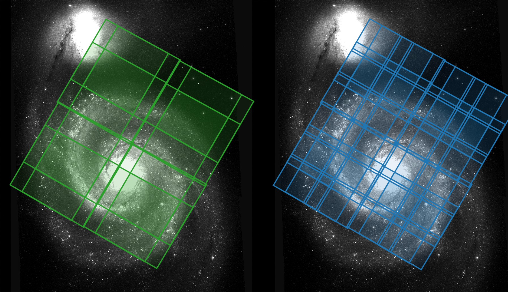
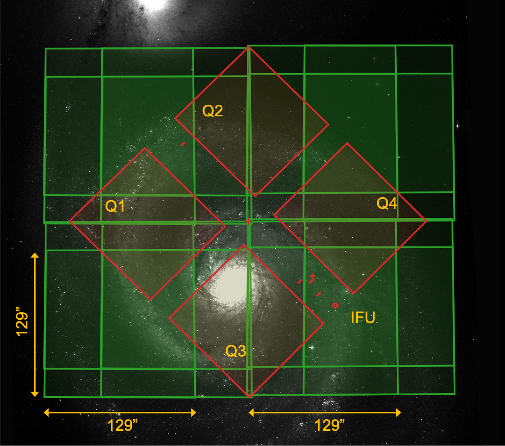
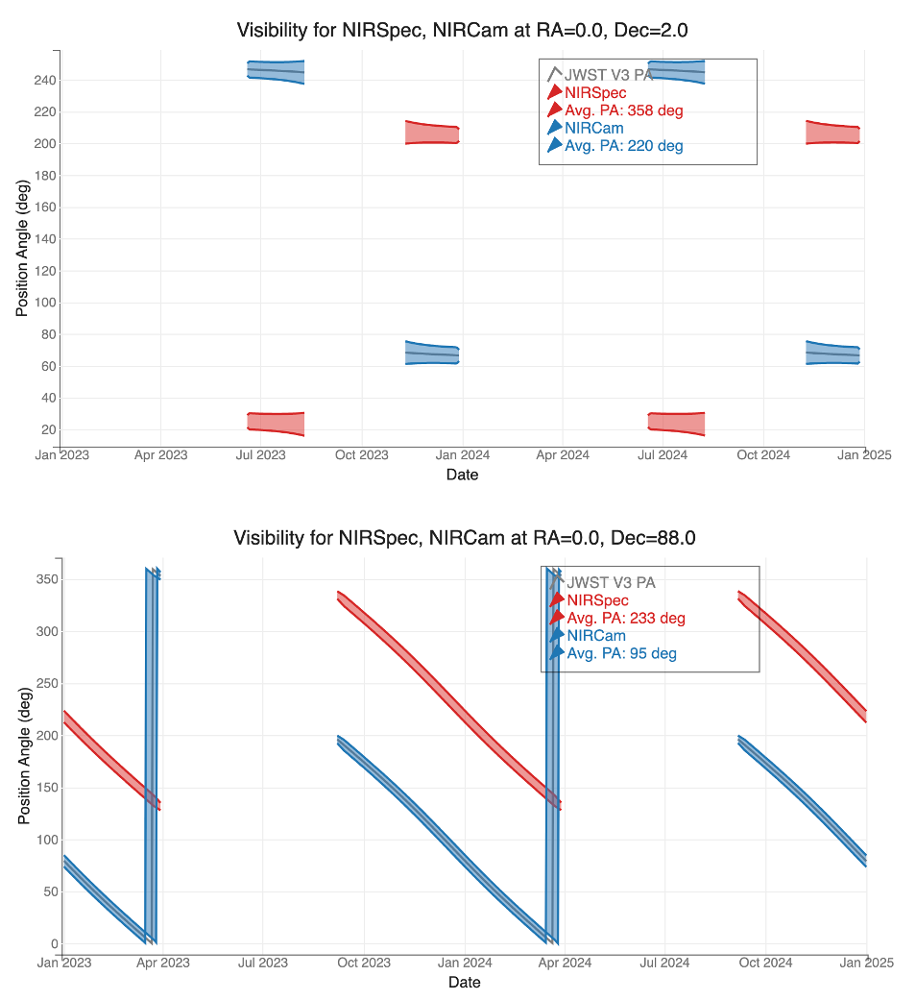

NOVT Usage
==========

..
   Text based on existing JDox article, 5/19/23

The NIRSpec Observation Visualization Tool (NOVT) was created to help users
simultaneously visualize the fields of view of both the NIRSpec
(`MOS mode <https://jwst-docs.stsci.edu/jwst-near-infrared-spectrograph/nirspec-observing-modes/nirspec-multi-object-spectroscopy>`__)
and NIRCam
(`short and long wavelength channels <https://jwst-docs.stsci.edu/jwst-near-infrared-camera/nircam-observing-modes/nircam-imaging>`__).
This tool can be used for observation planning for programs that seek to acquire
imaging using NIRCam (especially NIRCam pre-imaging). However, it can also be used to
visualize NIRSpec MOS observations prior to observation planning using the
`MSA Planning Tool (MPT) <https://jwst-docs.stsci.edu/jwst-near-infrared-spectrograph/nirspec-apt-templates/nirspec-multi-object-spectroscopy-apt-template/nirspec-msa-planning-tool-mpt>`__
in the `Astronomers Proposal Tool (APT) <https://jwst-docs.stsci.edu/jwst-astronomers-proposal-tool-overview>`__.

NOVT is meant to improve user understanding of the observatory orientation and field constraints.
It is not recommended to use the tool to derive strict execution orientation restrictions on either
the NIRCam or NIRSpec observations. As is true for all JWST programs, observations are easier
to schedule and accommodate in observatory planning if they have no execution orientation
restrictions at proposal submission.

Motivation
----------
NIRSpec will acquire sensitive multi-object spectroscopy (MOS) by placing science sources
in the open 0.20" wide micro-shutter assembly (MSA) spectral shutters. In order to plan the
observations, catalog coordinates with exquisite relative accuracy will be needed for the
most accurate placement of science sources within their MSA shutters, which translates to
optimal data calibration accuracy. NIRCam is the primary imaging camera for JWST, and it
is a source for high quality images for planning NIRSpec spectroscopy and target acquisition.
The process of pre-imaging an astronomical field has been developed to support the
NIRSpec observation planning, particularly for the complex MOS mode.

Pre-imaging observations are images usually acquired using the same telescope as the
multi-object spectroscopy, though not necessarily the same instrument, and are executed in the
same observatory semester or cycle. Pre-images are used to define field astrometry for spectral
target acquisition and aperture slit placement on science objects. As a result, rapid
availability and accuracy of pre-imaging is very important for the success of multi-object
spectroscopy planning.

NIRSpec MOS observers need to provide accurate catalogs (relative astrometry of 15
milliarcsec or less) to pursue their observations with optimal source placement in
MSA shutters, and those will be derived from space-based observations. When such high
accuracy catalogs are not available,
`NIRCam pre-imaging <https://jwst-docs.stsci.edu/jwst-near-infrared-spectrograph/nirspec-operations/nirspec-mos-operations/nirspec-mos-operations-pre-imaging-using-nircam>`__
will be needed for science planning
to achieve optimal data calibration. The term *NIRCam pre-imaging* is used to describe the
use of the NIRCam images to support planning for a NIRSpec observation.

This motivated the creation of the NOVT to help users simultaneously visualize the fields
of view of both instruments: NIRSpec and NIRCam.

Accessing the application
-------------------------

NOVT tools may be used directly by a user by installing the Python package, or they may
be accessed via a web application served by STScI (coming soon).  For more information on
using the Python tools, see the `software documentation <https://jwst-novt.readthedocs.io>`__ or the
`example notebooks <https://github.com/spacetelescope/jwst_novt/tree/main/jwst_novt/notebooks>`__ in the
source distribution. The below sections describe usage for the default NOVT application, run
either locally or on the STScI host.

To run the NOVT application locally, follow the instructions to install the
`core + display tools <https://jwst-novt.readthedocs.io/en/latest/jwst_novt/install.html#installation>`__.
Then, from the command line, start the NOVT application with::

    $ novt

The application will open in your default browser.

User interface
--------------

The NOVT application is operated from a graphical user interface (GUI) as seen in
:numref:`interface`. Its main purpose is to display a user-provided image as reference
background, and allow the creation of footprints for both the NIRSpec MSA and NIRCam
long and short wavelength channels in a variety of configurations (e.g., dither offsets and
mosaics). The footprints are generated by transforming the
`Science Instrument Aperture File (SIAF) <https://jwst-docs.stsci.edu/jwst-observatory-characteristics/jwst-observatory-coordinate-system-and-field-of-regard/jwst-instrument-ideal-coordinate-systems>`__
aperture coordinates into sky coordinates and overlaying the resulting regions on the reference
background image.

.. figure:: images/interface.png
   :name: interface
   :alt: NOVT web application interface, showing tabs with titles:
         Upload Data, Configure NIRSpec Apertures, Configure NIRCam Apertures,
         Show Timeline, Save Data, View Image

   NOVT interface

The NOVT GUI allows the user to perform the following actions:

- :ref:`upload_data`
- :ref:`configure_nirspec`
- :ref:`configure_nircam`
- :ref:`show_timeline`
- :ref:`save_data`

These actions are discussed in detail in the following sections.

Example data
~~~~~~~~~~~~

The example below is based on an HST mosaic of the galaxy pair NGC5194 +
NGC5195 generated using Hubble archival data from HST GO Program 10452 (PI: S. Beckwith).
The filter used for this observation is F814W, and the image is in units of e–/sec.
The FITS file can be obtained from the
`LEGUS Public Access Table <https://archive.stsci.edu/prepds/legus/dataproducts-public.html>`__
under target name "NGC 5194 + 5195 FULL Mosaic". This is the FITS file F814W mosaic with name
"hlsp_legus_hst_acs_ngc5194-ngc5195-mosaic_f814w_v1_sci.fits".
The source catalog
(`m51.radec <https://jwst-docs.stsci.edu/files/121706162/121706183/1/1625338095703/m51.radec>`__)
contains a selection of massive young clusters. Its format is described in :numref:`m51_catalog_format`.

For NOVT purposes, only the first 3 columns are used.  The first two (RA and Dec)
are required for all catalogs. The Flag column is optional.

.. table:: Format of source catalog m51.radec
   :name: m51_catalog_format

   +----------------+-------+-------+----------+------------------------------------------+
   |                | Name  | Type  | Unit     | Description                              |
   +================+=======+=======+==========+==========================================+
   | **column 1**   | RA    | Float | degrees  | Right Ascension of the source            |
   +----------------+-------+-------+----------+------------------------------------------+
   | **column 2**   | Dec   | Float | degrees  | Declination of the source                |
   +----------------+-------+-------+----------+------------------------------------------+
   | **column 3**   | Flag  | String|          | Primary source (P) or Filler source (F)  |
   +----------------+-------+-------+----------+------------------------------------------+
   | **column 4**   | F814W | Float | magnitude| F814W magnitude of the source            |
   +----------------+-------+-------+----------+------------------------------------------+

.. _upload_data:

Upload Data
~~~~~~~~~~~

For most common NOVT use cases, the first step is to upload an image of the target of interest.
Start by opening the `Upload Data` tab.

Try to use an image that covers a region of ~200" × 200" or more of your field of interest. Use
the `Image File` button to browse your computer and choose the image. The only supported
cases are FITS files with science data stored in extension 0 and with a valid World Coordinate
System (WCS) associated with it. The image should be corrected for distortion.  If you attempt to
load an image without a valid WCS, it may appear in the viewer, but no overlay features will be
available.

FITS data validation
^^^^^^^^^^^^^^^^^^^^

In order to verify which extension contains the science data in your FITS file, use the
following Astropy command line tool::

    > fitsinfo image.fits

where in place of 'image.fits' you should use the name of your file.

The information provided by this command will help you identify the extension number
of your science data. If the science data is in extension 0, then the FITS
file is valid. If the science data is in another extension, consider creating a new FITS file
using the information provided in the
`astropy.io.fits documentation <http://docs.astropy.org/en/stable/io/fits/>`__.

In order to verify the validity of the WCS keywords in the header of your image, you may also
use the Astropy command line tool wcslint::

    > wcslint image.fits

If no issues are reported, then the file should work.

Image display
^^^^^^^^^^^^^
Once the image has been uploaded, it is automatically displayed in a viewer tool integrated
in the NOVT interface. If the `View Image` tab is not already open, expand it now to view your
image (:numref:`view_image`).

NOVT uses `Imviz <https://jdaviz.readthedocs.io/en/latest/imviz/index.html>`__ as its viewer tool.
Imviz is a full-featured FITS image display tool developed by STScI as part of the
`Jdaviz <https://github.com/spacetelescope/jdaviz>`__ package. You can use the toolbars included
in Imviz to configure your image display (image stretch and colormap, zoom and pan, etc.).

Note that only one FITS image can be loaded into NOVT in a session.  If you need to replace an uploaded
image with a new one, save your work if needed (see :ref:`save_data`), then reload the browser window
to reset NOVT.

.. figure:: images/view_image.png
   :name: view_image
   :alt: Imviz viewer showing an example FITS image of NGC 5194 and NGC 5195.

   Imviz viewer with loaded FITS image

Source catalog
^^^^^^^^^^^^^^

Displaying individual sources from a catalog is an optional step. Creating an MSA
observation requires the construction of a catalog of sources, from which candidate
sets of primary and filler sources are usually derived. In order to display a source
catalog in NOVT, you will have to create a white space-separated text file with the
column structure described in :numref:`catalog_format`.

.. table:: Column format for input catalog
   :name: catalog_format

   +----------------+-------+-------+----------+------------------------------------------+-----------+
   |                | Name  | Type  | Unit     | Description                              | Required? |
   +================+=======+=======+==========+==========================================+===========+
   | **column 1**   | RA    | Float | degrees  | Right Ascension of the source            |  Yes      |
   +----------------+-------+-------+----------+------------------------------------------+-----------+
   | **column 2**   | Dec   | Float | degrees  | Declination of the source                |  Yes      |
   +----------------+-------+-------+----------+------------------------------------------+-----------+
   | **column 3**   | Flag  | String|          | Primary source (P) or Filler source (F)  |  No       |
   +----------------+-------+-------+----------+------------------------------------------+-----------+

It is possible to have additional columns, but they will not be used by this application.
If there are only 2 columns, the code will assume they are the RA and Dec of each source and display
them as a single overlay. If there exists a third column with a classification
(primary source or filler source) then the application will generate separate overlays
for each type, displayed with different colors for visual aid. :numref:`view_catalog`
shows an example of sources displayed close to the center of M51.

   Imviz viewer with loaded primary and filler source catalogs

To upload your catalog, use the `Catalog file` button in the `Upload Data` tab.
The expected file extension is ".radec". If your text file has a different extension,
you may need to use the options in the file dialog to enable all files before your catalog
can be selected.

To turn on or off catalog overlays in your FITS image, toggle the
`Primary Sources` or `Filler Sources` buttons above the viewer, in the `View Image`
tab. The colors assigned to the catalogs may be edited in the `Appearance` tab,
under `Upload Data`.

.. _configure_nirspec:

Configure NIRSpec Apertures
~~~~~~~~~~~~~~~~~~~~~~~~~~~

The `NIRSpec MSA <https://jwst-docs.stsci.edu/jwst-near-infrared-spectrograph/nirspec-instrumentation/nirspec-micro-shutter-assembly>`__
contains ~250,000 micro-shutters (apertures) that are organized in 4 quadrants. These
quadrants cover the sky over a 12.4 arcmin² field of view as shown in :numref:`msa`.
Each open micro-shutter, when projected onto the sky, has dimensions of only 0.20"
in the dispersion direction by 0.46" in cross-dispersion.

         Q1, Q2, Q3, and Q4 in yellow. One dimension is marked as 204"; the other
         is marked as 216".

   NIRSpec MSA and IFU fields of view

   The NIRSpec apertures (MSA quadrants, IFU, and fixed slits) are overplotted on an
   HST/ACS image of M51. The location of the fiducial point is marked with a plus sign.
   The IFU aperture is shown on the right side between MSA quadrants 3 and 4. The
   small fixed slits are also shown in red. The yellow labels are not part of the application,
   they are used here to guide the user in the identification of the different apertures,
   and to show scale.

The NIRSpec integral field unit (IFU) is a larger (3" × 3") aperture that is located in
the bar separating the MSA quadrants. The positioning of the IFU in the sky projection
allows for a quick identification of the MSA quadrants. The IFU aperture is placed between
quadrants 3 and 4 as shown in :numref:`msa`.

The NIRSpec fixed slits are smaller apertures located on the mounting frame in the space
between the MSA quadrants.

NOVT allows the user to display all the NIRSpec apertures at
once: the MSA quadrant footprints, the fixed slits, and the IFU footprint on the
Imviz display. In order to display or hide the footprints, toggle the `NIRSpec`
button in the `View Image` tab (:numref:`nirspec_overlay`).
The color and fill opacity for the NIRSpec overlay
may be configured in the `Appearance` tab under `Configure NIRSpec Apertures`.

   Imviz viewer with NIRSpec footprint at PA = 272°.

The center of the field is defined by the user with the form fields `RA` and `Dec` in
the `Position` tab under `Configure NIRSpec Apertures`. These parameters must be entered in
decimal degrees. After entering a value, hit return or click away from the field to apply the change.

The `PA` field should be set to the aperture position angle (APA) of the MSA, expressed
in units of degrees. The allowed values for this angle for a specified date range are given by the
`JWST General Target Visibility Tool (GTVT) <https://jwst-docs.stsci.edu/jwst-other-tools/jwst-target-visibility-tools/jwst-general-target-visibility-tool-help>`__.
A customized interface to this tool is provided in NOVT; see :ref:`show_timeline`.
Further information on JWST position angles can be found in the
`Specifying JWST Position Angles <https://jwst-docs.stsci.edu/jwst-observatory-characteristics/jwst-position-angles-ranges-and-offsets>`__
article.

The recommended practice in MSA observation planning is to experiment with a range of aperture
position angles as opposed to one single fixed angle. Since programs that specify fixed orientations
can restrict scheduling opportunities, most NIRSpec MOS programs will be submitted without
orientation restrictions, in order to allow the schedulers to find suitable windows for them. Once
an accepted MOS observation has been placed on a long range plan, a specific position angle will be
assigned for use in detailed planning.

.. _configure_nircam:

Configure NIRCam Apertures
~~~~~~~~~~~~~~~~~~~~~~~~~~

The JWST Near Infrared Camera (NIRCam) has 10 IR detectors. Two detectors are sensitive to
longer wavelengths (2.4–5.0 μm) and make the long wavelength channel (LWC). The remaining 8
detectors are sensitive in the range 0.6–2.3 μm and are collectively known as the short wavelength
channel (SWC). These detectors image the sky simultaneously over a 9.7 arcmin² field of view as
shown in :numref:`nircam_footprints`.

         labeled 129" along each dimension, in yellow. On the right, 8 NIRCam short
         detectors shown as green squares overlayed on a FITS image. One square is
         labeled 64" along each dimension, in yellow.

   NIRCam LWC and SWC footprints

   NIRCam has 2 channels that image the sky simultaneously: the long wavelength channel
   (LWC, left) and the short wavelength channel (SWC, right). Their fields of view are shown
   here on top of an HST/ACS mosaic of the galaxy pair NGC5194+NGC5195. The plus sign
   represents the fiducial point whose equatorial coordinates (RA, Dec) are defined by
   the user in the GUI. The yellow labels are not part of the application, they are used
   here to show scale.

The NOVT application was designed to display the LWC and
SWC footprints in several configurations, together or separately. As with the MSA
quadrants, their location on the plane of the sky is determined by the RA, Dec, and
aperture position angle of the fiducial point. These parameters are independent
of the MSA parameters because they are meant to design a NIRCam observation that
may take place months before the NIRSpec spectroscopy.

Enter RA, Dec, and aperture PA in the `Configure NIRCam Apertures` tab, using the same format rules
as with the MSA parameters. After entering a value, hit return or click away from the field to apply
the change.

Toggle the `NIRCam Short` or `NIRCam Long` buttons to show or
hide the NIRCam footprints in the viewer (:numref:`nircam_overlay`).
The colors and fill opacities for the overlays may be configured in the `Appearance` tab
under `Configure NIRCam Apertures`.

   Imviz viewer with NIRCam Short and Long footprints at PA = 134°.

Dither patterns
^^^^^^^^^^^^^^^

NIRCam imaging supports a variety of pre-defined dither patterns that optimize the use of
the observatory in imaging mode. The pre-imaging goal is to design an image that covers most of
the MSA footprint to design a proper MOS observation. Three FULL patterns are considered for this
application: FULL3, FULL3TIGHT, and FULL6 with 3, 3, and 6 dither pointings respectively.
A 4th dither pattern that is NIRSpec specific is the FULLBOX 8NIRSPEC. This pattern is designed
to cover a 6' × 5' region large enough for NIRSpec pre-imaging using 8 dither points. The
properties of these patterns are described in the
`NIRCam Primary Dithers <https://jwst-docs.stsci.edu/jwst-near-infrared-camera/nircam-operations/nircam-dithers-and-mosaics/nircam-primary-dithers>`__
article. :numref:`dither_options` shows the options in the drop-down menu.

.. figure:: images/dither_options.png
   :name: dither_options
   :alt: NOVT form fields showing dither options: NONE, FULL3, FULL3TIGHT,
         FULL6, 8NIRSPEC.

   Selecting NIRCam dither patterns

In order to display a NIRCam dither pattern, select the pattern by name and
toggle on the NIRCam buttons in the `View Image` tab. The additional footprints should be
overplotted on top of the background image. :numref:`full_dither` shows the three FULL dither options
for both channels. :numref:`8nirspec` shows the 8NIRSPEC NIRCam dither pattern on the same target.
:numref:`nirspec_with_dither` presents a comparison of fields of view of the 8NIRSPEC dither pattern
with the MSA footprint overplotted on M51.

.. figure:: images/full_dither.png
   :name: full_dither
   :alt: 6 images showing various dither patterns for long and short channels as
         sets of square overlays on a FITS image.

   Available NIRCam FULL dither patterns

   Different views showcasing the available NIRCam dither patterns in the application.
   The top row represents the FULL3, FULL3TIGHT, and FULL6 patterns using the LWC.
   The bottom row displays the same patterns using the SWC. The background image is an
   HST/ACS mosaic of the galaxy pair NGC5194+NGC5195. The aperture position angle used
   for this figure is 60°.

   NIRCam FULLBOX 8NIRSPEC dither pattern

   The 8NIRSPEC FULLBOX dither pattern shown using the LWC (left) and SWC (right).
   The background image is an HST/ACS mosaic of the galaxy pair NGC5194+NGC5195.
   The aperture position angle used for this figure is 60°. This pattern covers a
   rectangular region without gaps.

         Q1, Q2, Q3, and Q4, in yellow. NIRCam Long arrays are labeled 129" along
         each side, in yellow.

   NIRCam 8NIRSPEC dither pattern and the MSA

   The 8NIRSPEC FULLBOX dither pattern shown in green (vertical and horizontal lines)
   together with the NIRSpec apertures in red (diagonal lines). Note that the dither pattern
   is designed to cover the MSA footprint at any aperture position angle. The yellow labels are
   not part of the application, they are used here to show the position of the MSA quadrants and
   the IFU and to show scale.

Mosaic patterns
^^^^^^^^^^^^^^^

`NIRCam mosaic patterns <https://jwst-docs.stsci.edu/jwst-near-infrared-camera/nircam-operations/nircam-dithers-and-mosaics/nircam-mosaics>`__
are created using vertical and/or horizontal offsets. Mosaics are composed of tiles, where each tile corresponds
to one pointing. Only 2-tile mosaics are supported by this application. Offsets are relative to the selected
aperture's reference position in that aperture’s ideal coordinate system (X, Y). For NIRCam, all aperture
Ideal coordinate systems are nearly aligned (to ~1° rotation) with the JWST coordinate system (V2, V3).

The offsets are defined in NOVT by setting both `Vertical offset` and `Horizontal offset` values in units of
arcsec. Once those numbers are entered, set the `Mosaic` field to 'Yes' and the footprint overlays
will automatically update. :numref:`nircam_mosaic` shows an example of a NIRCam mosaic on top of the MSA footprint.

.. figure:: images/nircam_mosaic.png
   :name: nircam_mosaic
   :alt: NIRCam mosaic controls showing Mosaic = Yes, Horizontal offset = 48, Vertical offset = 60.
         Below, NIRSpec and NIRCam Long footprints are overlaid on a FITS image. The NIRCam Long
         overlay is a set of 4 fields, representing a 2-tile mosaic.

   NIRCam mosaic example

   Two tile mosaic example created using the NIRCam LWC. The gap between the modules is 45"
   and 48" for the long wavelength detectors. In this case we chose 48" as the horizontal offset
   and 60" for the vertical offset. For reference, the MSA field of view is also shown in red using
   the same equatorial coordinates (RA, DEC) for the fiducial point. MSA quadrants 1 and 4 are
   completely covered by the NIRCam detectors. The NIRCam aperture position angle is 0° and the
   NIRSpec aperture position angle is 45°.

.. _show_timeline:

Show Timeline
~~~~~~~~~~~~~

In order to help the user in the definition of ranges of aperture position angles,
this application includes customized plots of visibility data provided by the
`JWST General Target Visibility Tool <https://jwst-docs.stsci.edu/jwst-other-tools/jwst-target-visibility-tools/jwst-general-target-visibility-tool-help>`__.
This is a Python tool for calculating target visibility windows as a function of time,
based on a JWST ephemeris provided by JPL Horizons.

For a given RA and Dec, NOVT plots the aperture position angle range information
for NIRSpec and NIRCam within the allowed visibility windows. Open the `Show Timeline`
tab and click the `Make Timeline Plot` button to show the visibility and PA data.

The code reads the equatorial coordinates RA and Dec from the NIRSpec aperture section
and presents a plot over the coming year, by default. Edit the start and end date fields
to display different date ranges. Once the plot is displayed, icons can be selected to
pan and zoom in on the plot to see detailed information. The average angle in the plot
legend is updated to match the values in the date range currently shown.

:numref:`timeline_plot` shows 2 examples: a target close to the Equator and a target
close to the North Celestial Pole.

         RA=0, Dec=2 degrees. Bottom: Wide, nearly diagonal ranges of available
         PA for a target at RA=0, Dec=88 degrees. Date range for both is January
         2023 to January 2025.

   Visibility tool plots

Aperture position angle plotted as a function of time using the Visibility Tool.
[Bottom] Visibility plot obtained for a target located close to the north celestial
pole (RA=0.0º, Dec=+88.0º). [Top] Visibility plot obtained for a target located close
to the equator (RA=0.0º, Dec=+2.0º). Blue represents NIRCam, red represents NIRSpec;
the gray line represents the position angle of the V3 axis (V3_PA).

This Target Visibility plot is a "quick look" tool for pre-planning purposes, but the
APT defines if it is possible to schedule a given proposed observation. It is advisable
to select a range of feasible aperture angles and plan the creation of NIRCam observations
for a variety of positions.

The Target Visibility Tool calculates the minimum and maximum value for the
available aperture position angles. Both are included in the plot, as a shaded area,
for NIRCam and NIRSpec.  The V3 PA for JWST is also plotted as a gray line, for reference.

.. _save_data:

Save Data
~~~~~~~~~

Currently displayed overlay regions (NIRSpec or NIRCam footprints and primary or filler
source catalogs) can be downloaded from the NOVT app.  Open the `Save Data` tab and
enter a name for the downloaded file in the `Region file name` field. Click `Make Region File`
to generate the text file, then click `Download` to save it to your computer.
Only DS9 format is supported at this time, but regions may be recorded in either pixel
coordinates corresponding to your FITS image, or in sky coordinates.

To save your work, you may also download a NOVT configuration file.  This is a text file in
YAML format that specifies the values of any fields you have modified in the NOVT. To generate
it, click the `Make Config File` button under the `Save Data` tab, then click `Download`
to save it to your computer.  This config file can be used to restore your work in a future
run of the NOVT application: under the `Upload Data` tab, use the `Config file` button to
identify your config file.  A sample configuration file is shown in :numref:`config_file`.

.. literalinclude:: include/novt_config_m51.yaml
   :name: config_file
   :language: yaml
   :caption: Example NOVT configuration file, in YAML format.

Support
-------
If you need help with this application or encountered any problems, please contact the
`JWST Help Desk <https://stsci.service-now.com/jwst>`__ or file a ticket on the
`NOVT GitHub repository <https://github.com/spacetelescope/jwst_novt>`__.

References
----------
`Anderson, J. 2009, JWST-STScI-001738 <http://www.stsci.edu/files/live/sites/www/files/home/jwst/documentation/technical-documents/_documents/JWST-STScI-001738.pdf>`__
Dither Patterns for NIRCam Imaging

`Beck, T. et al. 2016, Proc. SPIE 9910 <http://proceedings.spiedigitallibrary.org/proceeding.aspx?articleid=2533905>`__
Planning JWST NIRSpec MSA spectroscopy using NIRCam pre-images

`Coe, D. 2017, JWST-STScI-005798 <http://www.stsci.edu/files/live/sites/www/files/home/jwst/documentation/technical-documents/_documents/JWST-STScI-005798.pdf>`__
More Efficient NIRCam Dither Patterns

`Cox, C. & Lallo, M. 2017, JWST-STScI-001550 <http://www.stsci.edu/files/live/sites/www/files/home/jwst/documentation/technical-documents/_documents/JWST-STScI-001550.pdf>`__
Description and Use of the JWST Science Instrument Aperture File

`Ubeda, L. & Beck, T. 2016, Proc. SPIE 9910 <http://proceedings.spiedigitallibrary.org/proceeding.aspx?articleid=2533930>`__
Planning your JWST/NIRSpec observation: pre-imaging and source catalogue
